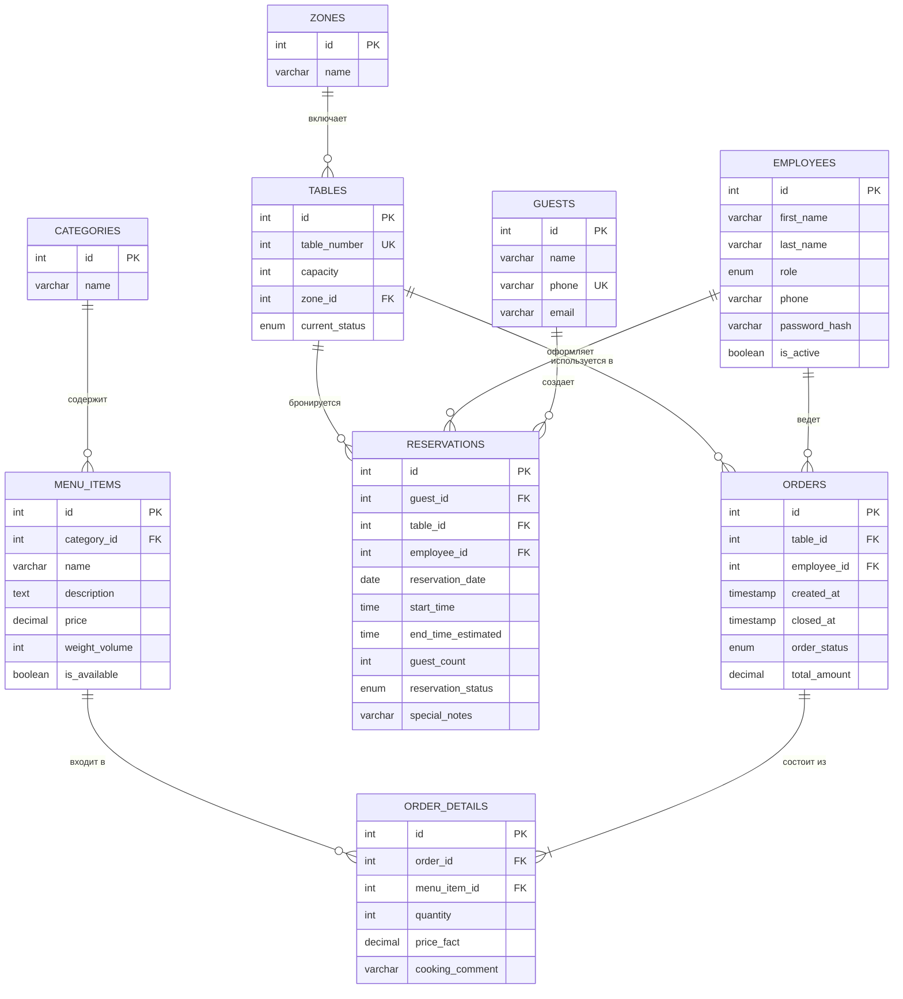

```mermaid
erDiagram
    ZONES ||--o{ TABLES : "включает"
    TABLES ||--o{ ORDERS : "используется в"
    TABLES ||--o{ RESERVATIONS : "бронируется"
    
    CATEGORIES ||--o{ MENU_ITEMS : "содержит"
    MENU_ITEMS ||--o{ ORDER_DETAILS : "входит в"
    
    EMPLOYEES ||--o{ ORDERS : "ведет"
    EMPLOYEES ||--o{ RESERVATIONS : "оформляет"
    
    ORDERS ||--|{ ORDER_DETAILS : "состоит из"
    GUESTS ||--o{ RESERVATIONS : "создает"

    ZONES {
        int id PK
        varchar name
    }

    TABLES {
        int id PK
        int table_number UK
        int capacity
        int zone_id FK
        enum current_status
    }

    CATEGORIES {
        int id PK
        varchar name
    }

    MENU_ITEMS {
        int id PK
        int category_id FK
        varchar name
        text description
        decimal price
        int weight_volume
        boolean is_available
    }

    EMPLOYEES {
        int id PK
        varchar first_name
        varchar last_name
        enum role
        varchar phone
        varchar password_hash
        boolean is_active
    }

    ORDERS {
        int id PK
        int table_id FK
        int employee_id FK
        timestamp created_at
        timestamp closed_at
        enum order_status
        decimal total_amount
    }

    ORDER_DETAILS {
        int id PK
        int order_id FK
        int menu_item_id FK
        int quantity
        decimal price_fact
        varchar cooking_comment
    }

    GUESTS {
        int id PK
        varchar name
        varchar phone UK
        varchar email
    }

    RESERVATIONS {
        int id PK
        int guest_id FK
        int table_id FK
        int employee_id FK
        date reservation_date
        time start_time
        time end_time_estimated
        int guest_count
        enum reservation_status
        varchar special_notes
    }
```
